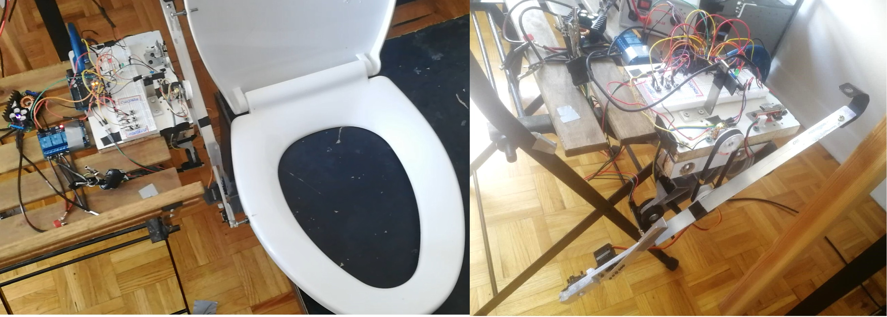
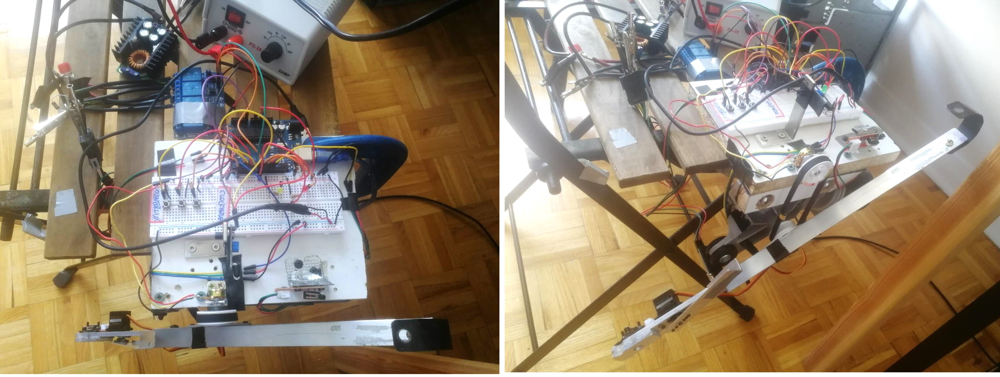
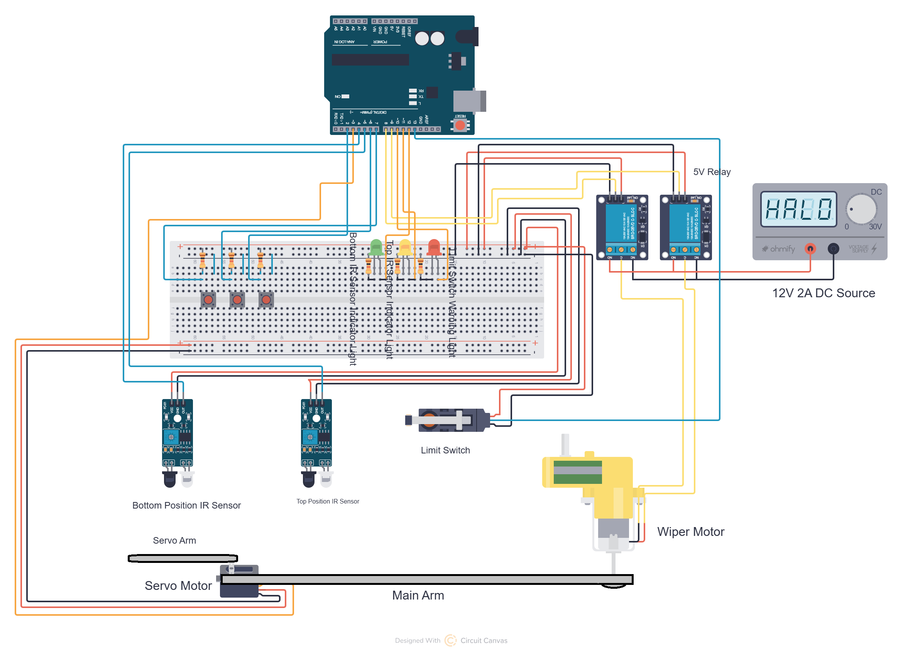
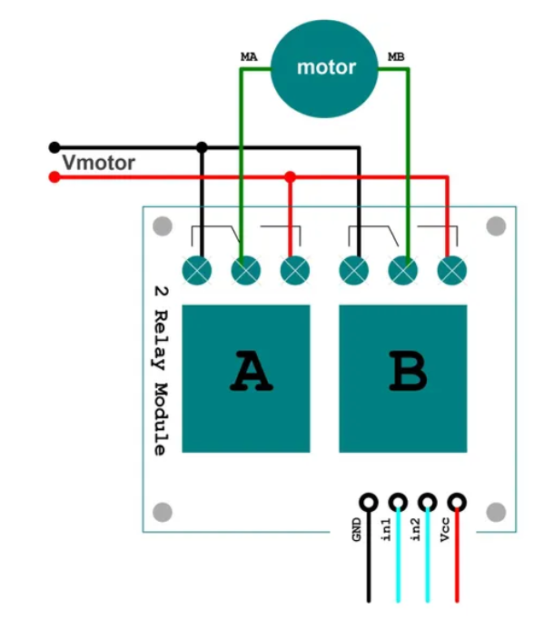
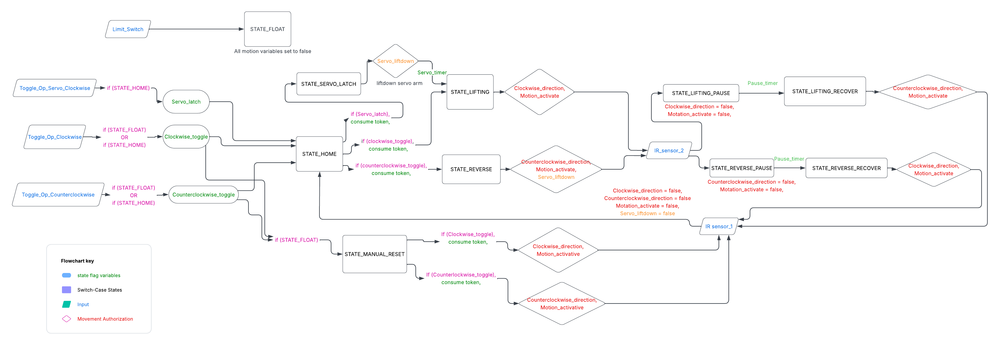
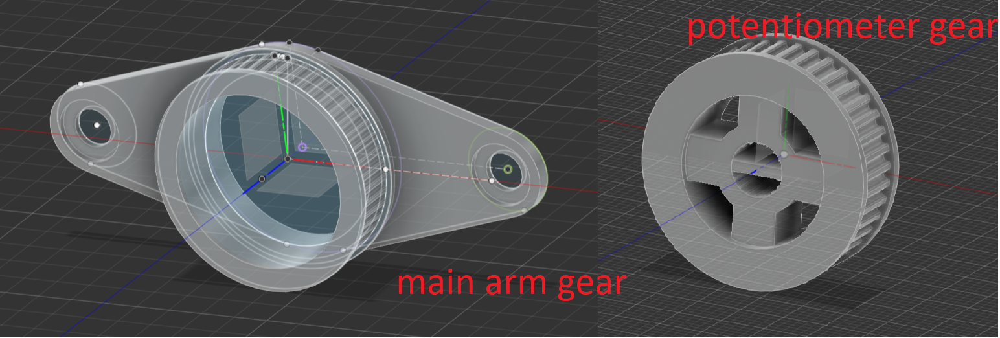
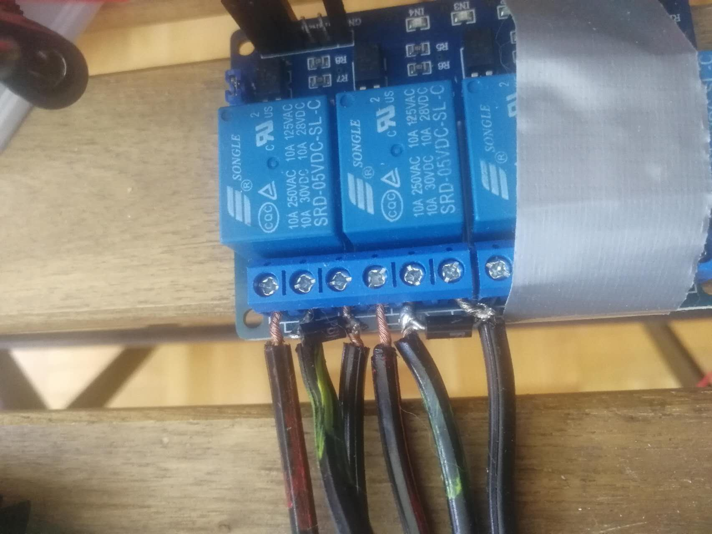

# Automatic_toilet_seat_operator
A toggle-activated rotating armature system to raise up and close either the top or both toilet seats. The armature is driven by a car wiper motor and a servo, while the system runs on Arduino code with IR sensors to limit its positions during rotation. 

Load test demostration:

load testing video with explaination on youtube: https://youtu.be/TG4GU5XdJvA?si=c8EunXvwlVA2-hOE

**Introduction:**

As a guy living with my girlfriend and her cat, I really don't like touching the toilet lids every time I am asked to put the seats down. So I built a automatic toilet seat operator, featuring a set of rotating aluminum armature with a car wiper motor driving the main arm, and a servo motor bolted to the end of the main arm driving a smaller arm. 

The main idea of the design is that when activated, the armature will catch the bolts attached to the toilet lids, and lift up either the top lid or both of the lids, and then push the lids back down. When the main arm alone rotates in clockwise direction, it will only catch the bolt on the upper lid and lift it up; When the servo motor spins down the smaller arm, the main armature will be extended to reach and catch the front bolt of the bottom lid; Therefore, when the arm lifts, both of the lids will be lifted. To lower the seats, the armature simply rotates in reverse to push the lids over, after which they will fall back down themselves. With this said, the current version of the code logic works best on a slow closing toilet seat, since otherwise for a set of free closing toilet seat, the lids will slam loudly every time they are pushed back down. 

Hardware View:

 
**Main Components:**

The main wiper motor is activated by a 2-relay system powered by a 12V 2A DC source with an optional step-down buck converter to regulate speed and torque,  while the Arduino and servo motor can be powered by a standard 5v phone charger. Preferably, the servo motor should have its own power supply so that it does not sag the current on the arduino. 

The mechanism is controlled by 3 toggle buttons: Button 1 raise the top lid. Button 2 latches the small arm down with the servo, extending the main arm, and then the main arm lifts up both lids. Button 3: reverses the main arm to push the lids back down. 

The rotating arm tells its position by two IR sensors: bottom IR sensor for homing position, and a top IR sensor for when the arm reaches to about 90 degree zenith of rotation. On initial start up, the system will detect if the arm is resting at home position to allow inputs, if not, the system will enter a float warming state and a manual reset is required to bring the armature back to homing position. 

Due to the design, the servo motor casing cannot allow the armature to rotate freely the full 360 degree. For safety, a limit switch is placed in the path of the servo casing, and will stop all system movements if activated. In this case, a float state warning will also activate demanding manual reset. I've had a unfortunate test incident where my faulty code failed to activate the limit switch and the servo casing hit the wood block, as it was at the time running on a 12V 15A DC source, there was so much torque that the plastic servo casing got ripped right off the aluminum arm. 

Wiring Diagram:

**Relay and Motor Wiring:**

2-relay H-Bridge: I used a 2-relay configuration from a 4-channel module, wiring the motor leads directly to the Common (COM) terminals. This design Electrical Interlock: Normally Closed (NC) pins connect to system Ground, and Normally Open (NO) pins tie to the positive DC motor supply line. This physical wiring layout makes it structurally impossible to create a direct short-circuit across the DC power supply, regardless of code errors. 

Relay wiring diagram:

**Armature Movement:**

Sequence of movement:
1. lifting up only the top lid;
2. Reverse to push lid down;
3. lifting up both lids by activating the servo and extending the arm;
4. Reverse to push both lids down.

Demonstration of movement logic of the armature:

YouTube video link: https://youtu.be/BwDyFDnwye8?si=BkIoQYhQGPaKe0z8

**Arduino Code Structure:**

Arduino code file:

The software is organized into three clean layers that split reading sensors, deciding what to do, and moving the motor. This prevents glitches and keeps the hardware safe. 

1. Sensor & Button Inputs (Modular Functions): Functions like IR_Sensors(), Limit_Switch(), and the button controllers run continuously on every loop cycle. They read input data, and translate button presses into simple internal request flags. 

2. Brain & Decision Engine (Switch-Case Structure):The core logic uses a clean switch-case state machine. It handles one step at a time (like HOME, LATCHING, or LIFTING) and  blocks out the other states. Instead of turning on pins directly, this section only updates internal state-flag variables to map out the desired direction. 

3. Motor Driver (Main Loop Activation):Physical relay pins are only permitted to switch at the very end of the main loop(). This dedicated output block acts as a gatekeeper: it checks key state-flag motion variables (e.g: clockwise_direction_state, motion_activate, and servo_liftdown) and executes the final movement on the armature.

Code logic flowchart

**Additional Features:**

While the IR sensors are sufficient to limit arm rotation, I added a redundancy rotation tracking system with a potentiometer and GT2 gear-belt set, where the main arm gear is coupled around the motor shaft, and the potentiometer gear sits on the potentiometer above. When the main arm rotates, the potentiometer will have a 1-1 ratio rotation, and the Arduino will pick up its analog reading (0-1023) and map on to the rotation angle. However this system is not very accurate and prone to gradual slippage, so I've not incorporated it into the main program. 

the main reference for my Fusion design is as follows: 
https://youtu.be/PDNIiLSTzG4?si=cXLuie5WhYatIrrd  

3D printed potentiometer GT2 gear set:

**Voltage Control and Current Protection:**

Step-down buck converter with CV and CC control (optional): controls main arm movement speed by adjusting step-down voltage; Controls torque by adjusting current ceiling. 

TVS diodes: soldered Transient Voltage suppression diodes across relay terminals for voltage spike protection on the motor side.

Relay protection:

**Upcoming bathroom Installation:**

As this project has been successfully tested, the next step will be actual installation in the bathroom so that the system will be fully functional. Which will involve many more upcoming works: 

Upgrading push buttons; 

Adding a touchless motion sensor relay switch to switch on and off the system upon entering and exiting the bathroom; 

Environment-proofing, wiring and electrical safety; 

Slotted L brackets for position calibration (front-back, up-down, left-right); 
Convincing my gf to actually put it next to the toilet, which would perhaps, be the ultimate challenge. 
